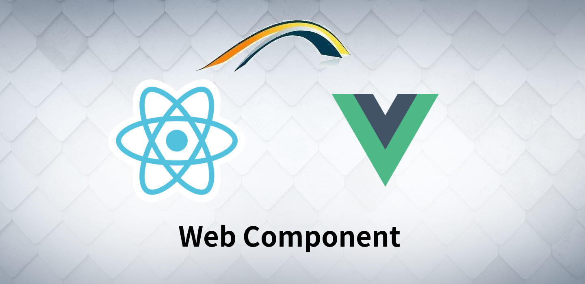

# 跨React/Vue技术栈解决方案


## 主流技术介绍

* React，使用JSX语法，ts支持较好，虚拟DOM

* Vue，使用独有vue格式模板，利用es5的getter/setter实现响应式，虚拟DOM

* Web Component，浏览器原生支持，其内部的shadow dom从v0升级到v1，从2011年发布至今，已经进入了一个支持相对较为普遍的技术。（IE作为可忽略因素）

## 需要解决的跨技术栈问题

    React与Vue两套技术方案并存，使大量ui与业务组件需要重复编写，工作量至少翻倍，会造成大量无法统一的组件表现

### 不同点

* React/Vue组件层级无论运行环境与实现都完全不同，太多说不过来

### 相同点

* 这两种框架都使用props向下层组件传递任意结构的数据。

* 在运行时，最终都使用virtual dom，将属性变更同步到真实dom上

    

### 技术难点

* 在上下层组件在都是相同框架组件的时候这种机制并没有问题，但在直接使用dom元素时，dom元素从上层组件中接收到的属性数据，都会被dom层直接简化为基本类型，即String，Boolean这两种格式，因此我们在前端开发时，在探测dom属性时，经常会看到`xxxx="[object object]"`这种情况

    如下图所示

    

    使用Web Component构造的自定义dom，也面临着上面这种问题，在数据结构被限制的情况下，是无法构造出真正可用的跨技术栈组件的

## [Web Component](https://developer.mozilla.org/zh-CN/docs/Web/Web_Components)解决方案



__解决方案当然是`Web Component`__

### 技术调研

#### 关于兼容性

`Web Component`的历史大约起始于2011年，其中的`shadow dom`标准从`v0`升级的到`v1`，经过了多年的浏览器大战，终于迎来了chrome掉打ie的大好局面 🎉 。只要不是需要兼容ie的项目，大都可以考虑使用。

#### 优势

此外还有如下几个优势，[摘自](https://www.cnblogs.com/ibufu/p/5641031.html)

* 互操作性 — 组件超越框架而存在，可以在不同的技术栈中使用

* 寿命 — 因为组件的互操作性，它们将有更长的寿命，基本不需要为了适应新的技术而重写

* 移植性 — 组件可以在任何地方使用，因为很少甚至没有依赖，组件的使用障碍要明显低于依赖库或者框架的组件

Web Component是对原生DOM的自定义操作，api很少，阅读一下很快就能掌握，大概(◔◡◔)

大家可以想象成类似于(正则表达式30分钟入门教程) 🍌 === 🦍 === 🌴

其中一个重要特性`observedAttributes`，可以达到定制需要监控属性值的目的，与React/Vue通过props传递数据流的思想是一致的

### 多框架源码分析

#### 针对React/Vue双方最终都使用虚拟DOM最终更新真实dom节点属性的情况，需要对比双方源码，比较其对真实dom的属性是如何操作的

* [preact](https://github.com/preactjs/preact/blob/master/src/diff/props.js#L115) 更新dom attribute 代码

* [vue](https://github.com/vuejs/vue/blob/dev/src/platforms/web/runtime/modules/attrs.js#L76)更新dom attribute 代码

* [react](https://github.com/facebook/react/blob/master/packages/react-dom/src/client/DOMPropertyOperations.js#L145)更新dom attribute 代码

#### 🔑关键步骤`setAttribute`

于是有了如下中台项目的具体实现----[scf-ui](http://git.jd.com/scf/scf-ui/blob/master/packages/ui/src/components/scfElement.tsx)

在实现web component自定义组件时，覆盖从父类继承的setAttribute方法进行拦截，可获取上级virtual dom传递的任意数据结构

按这种思路，不限于React与Vue，只要是使用virtual dom来更新dom属性的框架都可以使用web component封装组件来获取数据

其关键步骤的最简化原理如下

```javascript
class MyDom extends HTMLElement {
  setAttribute(name: string, value: any) {

    // 只有当前组件需要的属性，才需要接收原始值
    if (MyDom.observedAttributes.includes(name)) {
      this.data[name] = value
      this.renderContent()

    // 其他属性，按dom默认方法处理
    } else {
      super.setAttribute(name, value)
    }
  }

  // 需要监听更新的属性名数组
  static get observedAttributes(): string[] {
    return ['menus', 'user']
  }
}

```

#### 🤖 html的坑

* html对属性是不区分大小写的，例如`setAttribute('myName', 'xxx')`，`myName`会被自动转化为`myname`

如果是多单词组成的长名称属性，需要用`-`来组合

* 对于被setAttribute拦截的属性，没有调用`super.setAttribute`的情况下，默认的`attributeChangedCallback`方法是不会被调用的，需要手动触发

#### 🤖 React的坑

此处需要吐槽一下React

  

* 属性值需要额外处理

  `Vue`对属性并没有进行额外处理，而`React`为了保持某种兼容性，对属性值进行了强制字符串转化，[见代码](https://github.com/facebook/react/blob/master/packages/react-dom/src/client/DOMPropertyOperations.js#L145)

  `react`对自定义dom的`setAttribute`的`value`进行了`toString`处理，需要额外处理一下

* 无法使用React开发`web component`内部逻辑，原因是React的事件机制导致`web component`内部的react编写的组件的所有事件都无法运行

    参考[react-shadow-dom-retarget-events](https://github.com/spring-media/react-shadow-dom-retarget-events)

    强制使用hack的方法解决该问题，会导致页面运行效率问题

#### 解决方案

* ~~重置javascript `+` 操作符，使加法操作返回对象~~ 经过调研发现，目前做不到，定制对象的`toString`或`valueOf`方法而改变的`+`行为最终的返回结果只能是字符串或数字

* ~~通过[babel插件](https://www.npmjs.com/package/babel-plugin-operator)，达到重置`+`操作符的行为~~ 需要引入额外的依赖，而且会改变所有代码操作符的行为，导致不可预知的问题

* ~~修改`react-dom`源码，更改强制转换字符串部分，之后打包为一个定制化的`react-dom`~~ 要求用户的React版本与定制版本react-dom保持一致，且需要经常根据官方react-dom升级版本同步升级，已经被否定

    该方案的有点是，可以做到在React/Vue中完全一致的组件使用行为，以`scf-layout`为例

##### React代码

```javascript
import '@scf/ui'

  <scf-layout
    menus={props.menus}
    basepath={basename}
    router={history}
  >
    ...
  </scf-layout>

```

##### Vue代码

```javascript
import '@scf/ui'

  <scf-layout
    :menus="menus"
    :basepath="basename"
    :router="router"
  >
    ...
  </scf-layout>

```

* 为react提供了一层额外的封装组件，通过ref向web component定义的dom传递数据，封装后可以做到在React与Vue环境中的除组件命名区别外，其他行为达到统一

React中使用大写字母开头的 __大驼峰__ 命名组件

Vue中使用全小写的横线分割的 __蛇形__ 命名组件

##### React代码

```javascript
import { ScfLayout } from '@scf/ui'

  <ScfLayout
    menus={props.menus}
    basepath={basename}
    router={history}
  >
    ...
  </ScfLayout>

```

##### Vue代码(与上一个方案相同，无变化)

```javascript
import '@scf/ui'

  <scf-layout
    :menus="menus"
    :basepath="basename"
    :router="router"
  >
    ...
  </scf-layout>

```

#### shadowDom内的dom操作

自定义dom的内部内容，理论上可以使用任何技术(目前React必须除外，原因如上)。当结构非常简单时，使用原生dom编程生成节点，或使用`web component`示例中的模板都可以

但当编写复杂逻辑组件是，这种方法会使前端开发退化到jquery时代

当前使用的方案是`Preact`

`Preact`是牺牲了很多`React`的兼容性与性能优化考虑来达到代码最小化简版`React`

### CSS

* web component内部css完全封装在内部，不受外部影响

* 当需要通过外层定制时，可以通过原生`css variable`特性来达到实时配置样式的效果，参考 [css 变量](http://www.ruanyifeng.com/blog/2017/05/css-variables.html)

## 未来TODO

* `shadow dom`内的部分调试不太友好，希望有类似`react-devtool`/`vue-devtool`的浏览器插件调试工具

* 调研`stencil`开发组件内部逻辑

* 以`vue`为基础的`web component`组件开发是可行的，目前只是缺少最佳实践

* `web component`组件测试用例编写的最佳实践
